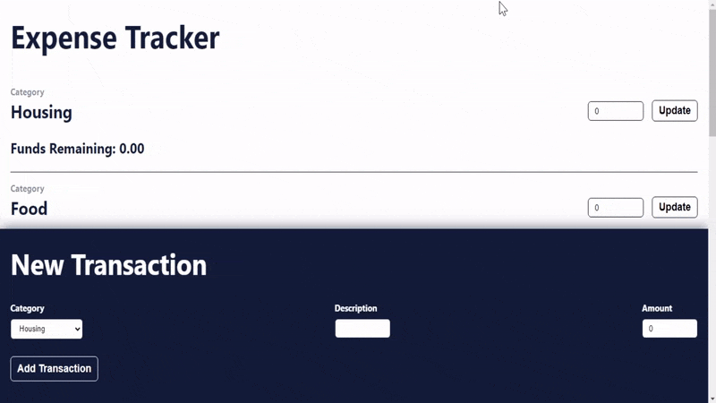

# Expense Tracker

A budgeting and expense tracking app for practicing refactoring with Redux Toolkit.
The app allows you to set budgets for various categories, such as food and transportation,
and track transactions in those categories. It then sums your spending in each category to
calculate the amount of money that remains to be spent.

## Screenshot

## Technology Used

- [HTML](https://www.w3.org/standards/webdesign/htmlcss)
- [CSS](https://www.w3.org/standards/webdesign/htmlcss)
- [JavaScript](https://developer.mozilla.org/en-US/docs/Web/JavaScript) ([ReactJs](https://reactjs.org/))
- [ReduxJs Toolkit](https://redux-toolkit.js.org/)

## Source

&copy; [Codecademy.com](https://codecademy.com) 2022.
